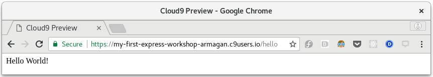

So our Express `app` object, which is our server, is listening for requests, but how will it know which requests to respond to and what to do when it does?

To do this Express keeps a list of items called 'routes'.  

Each route has three components:

1. A HTTP **request method**
2. A **URL path** (AKA **endpoint**)
3. A **handler function**

When the server receives a request, it looks at the request's URL path and request method.  If it has a route that matches both, then it responds to the request by running the handler function associated with the matching route.

This process of matching a request to the right **handler function** is called "routing".  

We add routes to our server to tell it which requests to respond to, and what to do for the response in each case.

## Adding a Route

To add a route using Express, you call the function for the **request method**, using the **URL** and your **handler function** as parameters.

Let's try adding a GET route.

Update `server.js` like so:

```javascript
var express = require('express');
var app = express();

app.get('/hello', function (request, response) {
  response.send('Hello World!');
});

app.listen(8080, function () {
  console.log('Server has started listening on port 8080.');
});
```

Our new lines use the `get` function, which adds a route for GET requests. GET requests that are sent to the `/hello` endpoint trigger our handler function, which sends back a simple text response of 'Hello World!'.

Make sure your changes to `server.js` are saved.

Now in your terminal press `ctrl + c` to stop your server running and run your server again with `node server.js`.

You will see the "Server is listening" message again.

So now that it's running, how do we send a GET request to it?  By using our trusty web browser of course.

Open a new browser window or tab and type in the address below:
 * **For Cloud9 Environment**

    <pre><code>https://<b>WORKSPACE</b>-<b>USERNAME</b>.c9users.io:8080/hello</code></pre>
    Don't forget to replace **USERNAME** with your Cloud9 username and **WORKSPACE** with the name of your workspace.

 * **For Local Environment**

    <pre><code>http://localhost:8080</code></pre>

Then press ENTER and you should see the "Hello World!" message displayed in your browser like a webpage.

It will look a little like this:

{:title="Testing the /hello endpoint in the browser" class="img-responsive imgbox"}

Every time you request a webpage in your browser, it is doing a GET request.  Sending GET requests is probably the most common daily activity in the world today.  :smile:

## Looking more closely at handler functions

The second parameter we supplied for the route was a **handler function**.

A handler function is just a regular Javascript function which `app` will invoke when a request matches the associated route.  `app` passes two parameters to it as well: one that contains the request data, and one to use to send a response.

Let's look at the handler function from the `/hello` route above:
```javascript
function (request, response) {
  response.send('Hello World!');
}
```

`request` contains all the information about the request that matched this route.  We don't use it in this example.  There is a massive amount of information in `request` and we will talk about this more in step #7.

`response` is what we use to send a response back to the client.  It has several different functions that we can use to do this.  In this example we used `response.send()`.

Exactly what steps you perform in each handler will depend on your application and the specific route that it belongs to.

## Try it yourself

Now you know a little more about routes and handler functions, try adding this new route yourself.

Here's what you need to know:

 * request method is `get`
 * the endpoint is `/chocolate`
 * the response should be `Mmmm, chocolate ...`

Test it by going to in your browser:

 * For Cloud9: `https://WORKSPACE-USERNAME.c9users.io:8080/chocolate`
 * For local: `http://localhost:8080/chocolate`


Check the solution below if you get stuck.

```javascript
var express = require('express');
var app = express();

app.get('/chocolate', function (request, response) {
  response.send('Mmmm, chocolate ...');
});

app.listen(8080, function () {
  console.log('Server has started listening on port 8080.');
});
```
{: .solution }
