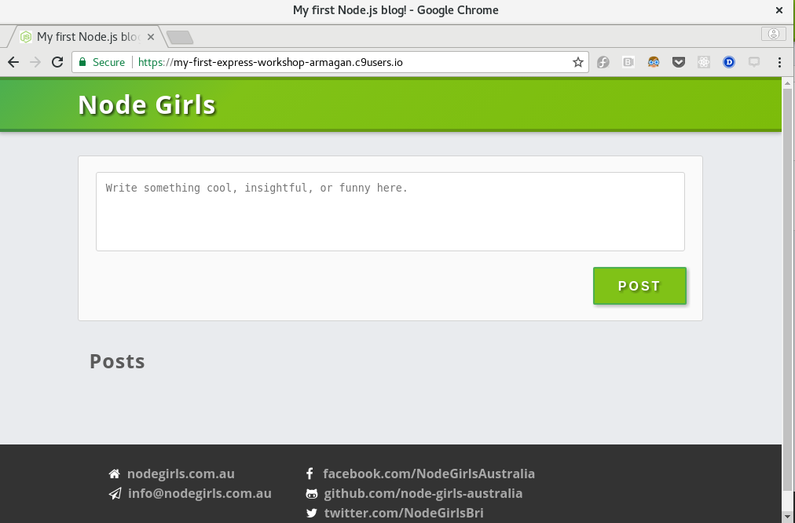

Now that we've seen the basics of routing and how to create an endpoint to send back a simple message let's look at the first major part of our app.  

When using our app, you are going to use the web page as the user interface.  Which means our server is going to have to serve up that page.  So how are we going to do that?

You could add a route for `/`, with a handler that opens `public/index.html` and sends it as the response. But you would have to create one for every file.  And every time you added a file, or renamed one, you would have more work to do.  That sounds really fiddly and error prone.  

Lucky for us, Express provides a **middleware** function to handle this situation: `express.static()`.  Middleware functions are like special **handler functions** that run on every request *before* our routes are processed.  

## Serving our static assets

All of the static assets for our app are in the `public` folder.  We are going to use `express.static()` to serve them.

1. Delete the routes you added in the previous step.  We aren't going to use them in our app.
2. Add the following line of code *after* the line with `var app = express();`.

    ```javascript
app.use(express.static("public"));
    ```
3. Restart your server, go to your app in your browser.

    * For Cloud9: `https://WORKSPACE-USERNAME.c9users.io:8080/`
    * For local: `https://localhost:8080/`

 If you see a `Node Girls` page, then your static assets have been successfully served.

{:title="Viewing the app in the Browser" class="img-responsive imgbox"}

This line tells `app` to use the `express.static()` middleware function and to point it at the folder `public`.

This means that whenever our app receives a GET request, it will first check in `public` to see if there is a file that matches the URL of the request.  If it finds one, then it sends that file back as the response.

It's a really good example of how Express can save you a lot of time.

If you are having problems getting it to work check the solution below:

```javascript
var express = require('express');
var app = express();

app.use('express.static('public')');

app.listen(8080, function () {
  console.log('Server has started listening on port 8080.');
});
```
{: .solution }
