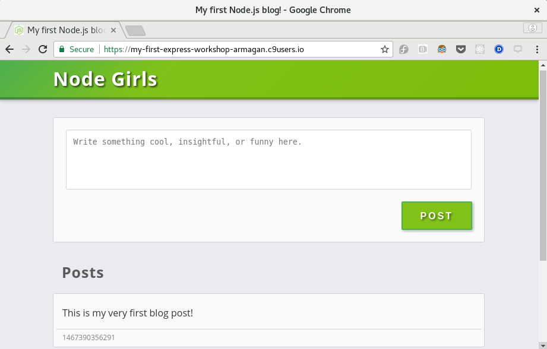

So now we have our web page being served up, but you might notice that it doesn't actually do anything.  There are no posts displayed, and clicking the "POST" button does nothing.  That's because both of those things in the page rely on server code that we need to write.

First up, let's display some posts.  

## Creating our new route

Our webpage already expects there to be an endpoint that gives it a list of all the posts.  

It expects that endpoint to have the following:

 * Endpoint URL: `/get-posts`
 * Request Method: GET

So we are going to need to add a route for this endpoint.  Add the following code:

```javascript
app.get('/get-posts', function(request, response){

});
```

This should go between `app.use(express.static())` and `app.listen()` in your `server.js` file.

Note that the handler function here doesn't do anything yet.

## Reading the posts.json file

There is a post already stored in the `data/posts.json` file. We want to store other posts here, too, but you don't need to worry about that yet - all you need to know is that this file has a post inside it.

If we want our `/get-posts` route's handler function to display posts, we need to read the `data/posts.json` file from disk and send the data in it as our response.

## The fs module

To read and write files we use the File System module `fs`.  

`fs` is included in Node.js but we still need to use `require` to import it into our app.

Add the following to the top of `server.js` to import `fs`:

```javascript
var fs = require('fs');
```

## fs.readFile()

The `fs` module has a lot of functions for dealing with files.  

We are going to use `fs.readFile()`.

`fs.readFile()` takes two parameters:

1. The path of the file to read from.
2. A **callback** function to run after the file is read successfully.

Add the following code inside of the handler function for `/get-posts`:
```javascript
fs.readFile(__dirname+'/data/posts.json', function(error, data){

});
```

`__dirname` is a special Node.js variable that holds the path of the folder where your program is running.

The parameters sent to the callback function are:

1. An error object, or `null` if no error occurred.
2. A contents of the file as a **buffer**, or `null` if there was an error.

The content of `data` is in a format called a **buffer**.  If you log it, it will look something like this:

```
<Buffer 7b 0a 20 20 20 20 22 31 34 36 37 33 39 30 33 35 36 32 39 31 22 3a 20 22 54 68 69 73 20 69 73 20 6d 79 20 76 65 72 79 20 66 69 72 73 74 20 62 6c 6f 67 ... >
```

A buffer isn't very useful for us here but we can invoke `.toString()` on it and get a human-readable text version of the file.

## Sending the response in our callback function

In our callback function we will do the following steps:

1. Check if there was an error
2. If there was an error, log it and send back an error response.  
3. Otherwise, convert our data buffer to a string and send that as the response.

Update your route to look like the following:

```javascript
app.get('/get-posts', function(request, response){
  fs.readFile(__dirname+'/data/posts.json', function(error, data){
    if(error){
      console.log('Error reading posts.json: '+error);
      response.status(500);
      response.send(error);
    } else {
      response.send(data.toString());
    }
  });
});
```

We indicate that an error occurred by setting `response.status`.  `200` is the default value and means "everything worked as expected".  `500` means "OMG something failed that we didn't expect".

We use `500` here because we really don't expect this to fail. In real world apps you should check for things like whether the file exists, has the right permissions, or has the content we expect, and then use an appropriate status code and message.  We aren't going to worry about that here.

## Check that it worked

1. Make sure you have saved your changes to `server.js`
2. Stop your server running (`ctrl+c`)
3. Start the server running again (`node server.js`)
4. Navigate to the app in a new browser window or tab:
    * For Cloud9: `https://WORKSPACE-USERNAME.c9users.io:8080/`
    * For local: `https://localhost:8080/`

You should see the same page as before, but this time with a post displayed:

{:class="img-responsive imgbox" title="Checking display of posts in the Browser"}

If it isn't working for you, you can double-check that your code is right with the solution below:

```javascript
var express = require('express');
var fs = require('fs');

var app = express();

app.use(express.static('public'));

app.get('/get-posts', function(request, response){
  fs.readFile(__dirname+'/data/posts.json', function(error, data){
    if(error){
      console.log('Error reading posts.json: '+error);
      response.status(500);
      response.send(error);
    } else {
      response.send(data.toString());
    }
  });
});

app.listen(8080, function () {
  console.log('Server has started listening on port 8080.');
});
```
{: .solution }

<!-- This is a common **pattern** in Node.js for asynchronous operations.   -->

<!--
```javascript
var fs = require('fs');

app.get('/get-posts', function(request, response){
  fs.readFile(__dirname+'/data/posts.json', function(error, file){
    response.send(file);
  });
});
```
-->

<!-- So now we're saving the blog posts to the server.  Time to get them and display them on the page!

If you look inside `public/script.js`, there's a whole bunch of JavaScript code in there.  Don't worry about what all the code means, just know that it's responsible for sending a request to GET old blog posts and display them on the page underneath "Recent Posts".

`script.js` is trying to load existing posts by making a GET request. Look inside `script.js` and see if you can find any useful endpoints.


Your `script.js` file will want to receive the JSON containing your blog posts.  Your job is to make that happen!

Express has a handy method called `res.sendFile()` that makes it easy to send files back to the client.  Feel free to use this with your JSON.


If all goes well, you should have a fully functional CMS!

## Congratulations!! 😍

### Now try out some stretch goals -->
