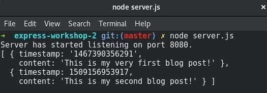

As we saw in the previous step, we need to actually save our new post otherwise it is just temporary.

All of our posts are saved in the file `data/posts.json`.

Because we are storing our data as JSON, we can't just "add" to the file as a single step.

What we will need to do is:

1. Read all the data from `data/posts.json`
2. Update that data
3. Write the updated data back to the original file again.

## Reading in the posts.json file

In order to manipulate our blogposts data we have to read it from the file and turn it into objects.

Reading the file is done the same way as in our `/get-posts` endpoint, using `fs.readFile`.

Update your `/create-post` endpoint as follows:

```javascript
app.post('/create-post', function(request, response){
  var now = Date.now();
  var newPost = {
    timestamp: now,
    content: request.fields.blogpost
  }

  fs.readFile(__dirname+'/data/posts.json', function(error, data){
    if(error){
      console.log('Error reading posts.json: '+error);
      response.status(500);
      response.send(error);
    } else {

      response.send(newPost);      
    }
  });

});
```

Notice how we've moved the `response.send(newPost)` inside of the `fs.readFile()` callback?  

This is because `fs.readFile()` is a non-blocking function.  Anything that we put after `fs.readFile()` is going to happen immediately after `fs.readFile()` starts, and almost certainly before it finishes.  If we want to ensure that certain code doesn't run until after a non-blocking function finishes then we must but that code inside of the non-blocking function's callback function.

In other words, if we don't want to send our response before finishing reading the file, which we don't want,  then we must send the response inside of the `fs.readFile()` function's callback function.
## What's in our posts.json file?

So now that we have read our file from disk, let's have a look at it.

Open up `data/posts.json` in an editor.  It will look something like:

```json
{
  "blogposts":[
    {
      "timestamp":"1467390356291",
      "content": "This is my very first blog post!"
    }
  ]
}
```

This format is called JSON (sounds like Jason) and it stands for Javascript Object Notation.

JSON is a way of describing Javascript objects as text independantly of Javascript code.  Javascript provides both a way to create JSON versions of your objects, and to take JSON text and turn it into objects.  This makes it really easy to do things like send data between programs or it to disk (and read it back).  You have already used it twice without realising it, both `/get-posts` and `/create-post` send JSON data.  Your project's `package.json` file is in JSON format too also.

JSON is supported by many other programming languages and has become a defacto way to send data between programs on the internet.

There are only a few simple rules in JSON:
 * `{` & `}` indicate the start and end of an object.
 * `[` & `]` indicate an array (list) of values where each value is separated by a comma
 * Objects have a comma-separated list of properties with the format: `"name": value`
 * A value can be a string, number, array or object.  
 * If a value is a string it must be enclosed by `"` characters.

So if we look at our `posts.json` file and apply those rules we can see that:

1. A single object (the `{}` characters at the beginning and end).
2. That object has one property, `blogposts`, whose value is an array
3. That array contains (currently) a single object
4. That object has two properties, `timestamp` & `content`

The object in the `blogposts` array is the post that we are currently seeing in the page.  Of course it has the same properties as the post object we sent back in the previous step.  What we will be doing is adding our new post object to this array.

## Parsing JSON


Once we have the file data we use `JSON.parse()` to turn it into an object.

`JSON.parse()` takes a string as a parameter and returns an object.  It also conveniently works with a file buffer too.  Neat.

Update your `fs.readFile` code as follows to parse the file data.

```javascript
fs.readFile(__dirname+'/data/posts.json', function(error, data){
  if(error){
    console.log('Error reading posts.json: '+error);
    response.status(500);
    response.send(error);
  } else {
    var posts = JSON.parse(data);

    response.send(newPost);      
  }
});
```

To experiment you could try adding a few `console.log()` statements before the `response.send()` to example the contents of the `posts` object.

For example:

```javascript
console.log(posts);
console.log(posts.blogposts);
console.log(posts.blogposts[0].content);
console.log(posts.blogposts.length);
```

Check it out by restarting your server & hitting the post button again & watching your terminal.

## Add our new post to the array

Ok so now we have our data from the file parsed and available to be manipulated. And we have the object that represents our new post.  So lets get them together.

We need to add our object to the blogposts array.

Arrays provide a bunch of different functions to make changes to them.

We are going to use `push()` to add `newPost` to the end of `posts.blogposts`.

Remove any `console.log()` statements you might have added above and add this line after the `JSON.parse()` line.

```javascript
posts.blogposts.push(newPost);
```

The `push()` method adds one or more elements to the end of an array and returns the new array.

To test this add a `console.log(posts.blogposts)`, (restart your server), and create a new post.  You should see the updated array logged in the terminal with your new post object.

{:class="img-responsive imgbox" title="Checking our modified blogposts array in the Terminal"}

If it isn't working for you, you can double-check that your code is right with the solution below.

We are so close to the end now.  Just one more step.


```javascript
var express = require('express');
var formidable = require('express-formidable');
var fs = require('fs');

var app = express();

app.use(express.static('public'));
app.use(formidable());

app.post('/create-post', function(request, response){
  var now = Date.now();
  var newPost = {
    timestamp: now,
    content: request.fields.blogpost
  }

  fs.readFile(__dirname+'/data/posts.json', function(error, data){
    if(error){
      console.log('Error reading posts.json: '+error);
      response.status(500);
      response.send(error);
    } else {
      var posts = JSON.parse(data);
      posts.blogposts.push(newPost);
      console.log(posts.blogposts)

      response.send(newPost);
    }
  });
});

app.get('/get-posts', function(request, response){
  fs.readFile(__dirname+'/data/posts.json', function(error, data){
    if(error){
      console.log('Error reading posts.json: '+error);
      response.status(500);
      response.send(error);
    } else {
      response.send(data);
    }
  });
});

app.listen(8080, function () {
  console.log('Server has started listening on port 8080. ');
});
```
{: .solution }
